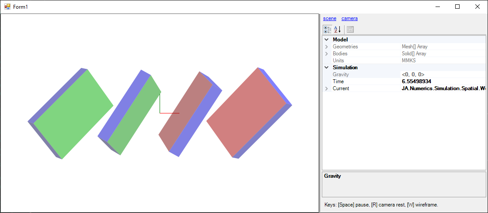

# JA.Numerics.Simulation

A WinForms 2D and 3D rigid body simulation project that builds on `System.Numerics` and their SIMD accelerated geometry classes
`Vector2`, `Vector3` and `Quaternion`.

Platform:

- .NET Framework 4.8
- Visual Studio 2022

A sample of the objects defined for usage in `JA.Numerics.Simulation.Planar`

- `Matrix2` a 2×2 matrix for transforming `Vector2` objects.
- `Vector21` a 2+1 vector for holding planar screw objects.
- `Matrix21` a (2+1)×(2+1) matrix for transforming `Vector21` objects.

A sample of the objects defined for usage in `JA.Numerics.Simulation.Spatial`

- `Matrix3` a 3×3 matrix for transforming `Vector3` objects.
- `Vector33` a 3+3 vector for holding spatial screw objects.
- `Matrix33` a (3+3)×(3+3) matrix for transforming `Vector33` objects.
- `Solid` a rigid body representation using the simulation solver.
- `Mesh` a basic mesh definition reprenting the shape of an object.
- `Scene` a collection of bodies and the main class for doing a simulation.

A sample of the general use objects defined within.

- `Vector` a general size vector class. This represents only a dense vector at the time.
- `Matrix` a general size matrix class. This supports various structured arrangements such as `MatrixStructure.Dense`, `MatrixStructure.Symmetric`, `MatrixStructure.Diagonal` and `MatrixStructure.Zero`.
- `LinearAgebra` an extension library to add functionality and blend with existing classes under `System.Numerics`.
- `Constants` various constants in single precission float types such as π, 1°. 1rpm and their inverses.
- `UnitFactors` a simple unit conversion utility fro varius types of quantities between `UnitSystem.SI`, `UnitSystem.MMKS`, `UnitSystem.IPS`, and `UnitSystem.FPS`.
- `Materials` mechanical properties library for steel, aluminum, cast-iron to help in deriving mass properties from shapes.

A sample of objects used in rendering and UI operations

- `Gdi` mostly color manipulating functions although other extensions to the standard gdi objects are going to be added as needed.
- `Camera` targets a control surface to render a `Scene`. Additionally, it keeps track of keyboard and mouse inputs in order to pause the simulation or to move the camera around.
